Running env with grid_size: 5x5
| Iter | Avg Reward | Max Reward | Min Reward | Avg Steps | Max Steps | Min Steps | Reached Goal | Goal % |
|------|-------------|------------|------------|-----------|-----------|-----------|---------------|--------|
| 8 - 10 | 34.30 | 86.00 | -199.00 | 35.00 | 100 | 14 | 9 | 300.0% |
| 18 - 20 | 76.20 | 88.00 | 54.00 | 18.40 | 28 | 12 | 10 | 333.3% |
| 28 - 30 | 87.80 | 92.00 | 72.00 | 11.30 | 19 | 8 | 10 | 333.3% |
| 38 - 40 | 86.00 | 92.00 | 78.00 | 9.50 | 13 | 8 | 10 | 333.3% |
| 48 - 50 | 89.20 | 92.00 | 78.00 | 9.90 | 16 | 8 | 10 | 333.3% |
| 58 - 60 | 90.80 | 92.00 | 82.00 | 8.30 | 10 | 8 | 10 | 333.3% |
| 68 - 70 | 90.00 | 92.00 | 82.00 | 9.10 | 10 | 8 | 10 | 333.3% |
| 78 - 80 | 89.40 | 92.00 | 80.00 | 9.70 | 12 | 8 | 10 | 333.3% |
| 88 - 90 | 90.40 | 92.00 | 82.00 | 8.70 | 10 | 8 | 10 | 333.3% |
| 98 - 100 | 91.20 | 92.00 | 86.00 | 8.80 | 14 | 8 | 10 | 333.3% |

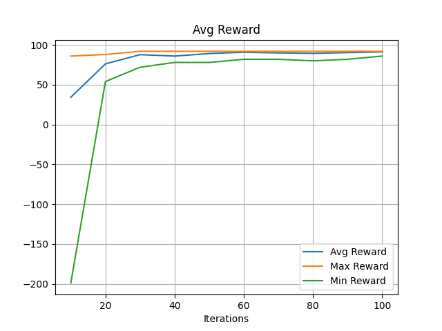
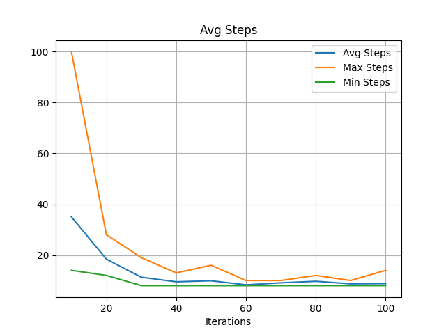
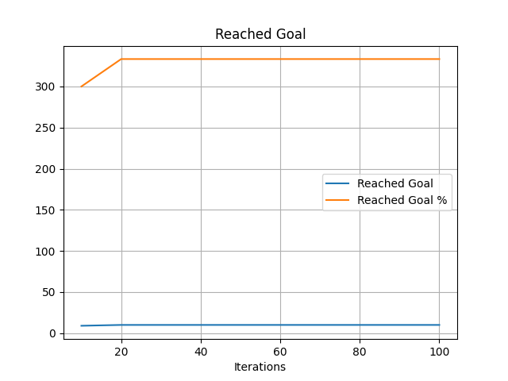
Running env with grid_size: 7x7
| Iter | Avg Reward | Max Reward | Min Reward | Avg Steps | Max Steps | Min Steps | Reached Goal | Goal % |
|------|-------------|------------|------------|-----------|-----------|-----------|---------------|--------|
| 8 - 10 | -6.20 | 80.00 | -199.00 | 58.30 | 100 | 20 | 8 | 266.7% |
| 18 - 20 | 25.00 | 72.00 | -118.00 | 56.00 | 100 | 28 | 9 | 300.0% |
| 28 - 30 | 56.40 | 76.00 | 14.00 | 35.50 | 77 | 15 | 10 | 333.3% |
| 38 - 40 | 68.60 | 88.00 | 40.00 | 27.80 | 51 | 12 | 10 | 333.3% |
| 48 - 50 | 78.60 | 88.00 | 56.00 | 17.80 | 26 | 12 | 10 | 333.3% |
| 58 - 60 | 66.60 | 88.00 | 42.00 | 23.50 | 40 | 12 | 10 | 333.3% |
| 68 - 70 | 82.20 | 88.00 | 68.00 | 16.00 | 23 | 12 | 10 | 333.3% |
| 78 - 80 | 78.80 | 88.00 | 68.00 | 16.70 | 24 | 12 | 10 | 333.3% |
| 88 - 90 | 81.80 | 88.00 | 68.00 | 14.60 | 17 | 12 | 10 | 333.3% |
| 98 - 100 | 85.40 | 88.00 | 82.00 | 14.60 | 18 | 12 | 10 | 333.3% |

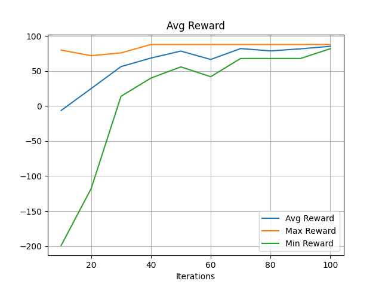
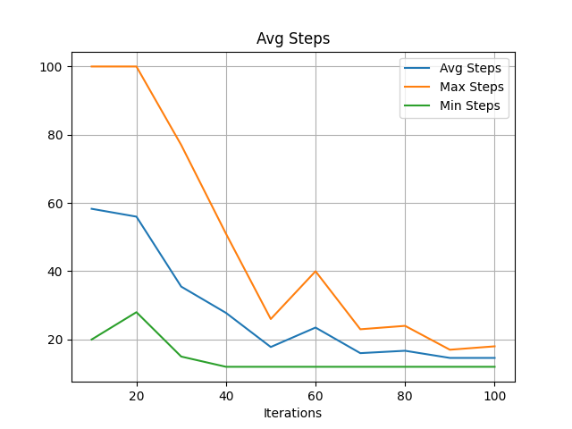
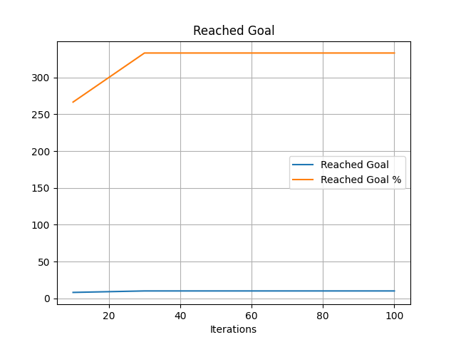
Running env with grid_size: 10x10
| Iter | Avg Reward | Max Reward | Min Reward | Avg Steps | Max Steps | Min Steps | Reached Goal | Goal % |
|------|-------------|------------|------------|-----------|-----------|-----------|---------------|--------|
| 8 - 10 | -114.40 | 4.00 | -181.00 | 95.70 | 100 | 69 | 2 | 66.7% |
| 18 - 20 | -55.80 | 62.00 | -118.00 | 85.90 | 100 | 29 | 4 | 133.3% |
| 28 - 30 | -59.40 | 40.00 | -136.00 | 87.70 | 100 | 42 | 4 | 133.3% |
| 38 - 40 | -53.20 | 34.00 | -109.00 | 85.10 | 100 | 48 | 4 | 133.3% |
| 48 - 50 | -35.60 | 68.00 | -118.00 | 77.50 | 100 | 32 | 5 | 166.7% |
| 58 - 60 | 23.80 | 52.00 | -100.00 | 63.50 | 100 | 39 | 9 | 300.0% |
| 68 - 70 | 30.00 | 64.00 | -16.00 | 62.80 | 98 | 35 | 10 | 333.3% |
| 78 - 80 | 28.80 | 62.00 | -8.00 | 64.90 | 99 | 38 | 10 | 333.3% |
| 88 - 90 | 50.00 | 76.00 | 16.00 | 45.50 | 66 | 24 | 10 | 333.3% |
| 98 - 100 | 53.40 | 72.00 | 18.00 | 43.00 | 73 | 28 | 10 | 333.3% |

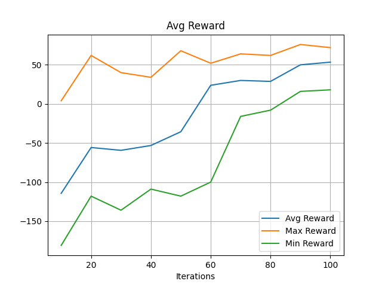
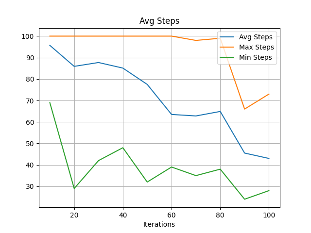
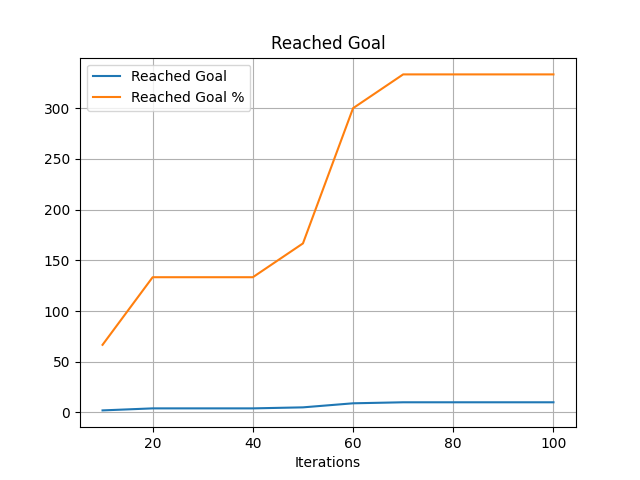
Running env with grid_size: 12x12
| Iter | Avg Reward | Max Reward | Min Reward | Avg Steps | Max Steps | Min Steps | Reached Goal | Goal % |
|------|-------------|------------|------------|-----------|-----------|-----------|---------------|--------|
| 8 - 10 | -132.40 | -100.00 | -226.00 | 100.00 | 100 | 100 | 0 | 0.0% |
| 18 - 20 | -122.50 | -100.00 | -181.00 | 100.00 | 100 | 100 | 0 | 0.0% |
| 28 - 30 | -98.10 | 36.00 | -154.00 | 95.50 | 100 | 55 | 1 | 33.3% |
| 38 - 40 | -87.50 | 38.00 | -136.00 | 93.10 | 100 | 62 | 2 | 66.7% |
| 48 - 50 | -91.80 | 36.00 | -118.00 | 95.50 | 100 | 55 | 1 | 33.3% |
| 58 - 60 | -81.30 | 18.00 | -118.00 | 96.80 | 100 | 82 | 2 | 66.7% |
| 68 - 70 | -89.60 | 40.00 | -109.00 | 95.10 | 100 | 51 | 1 | 33.3% |
| 78 - 80 | -73.50 | 12.00 | -118.00 | 92.70 | 100 | 69 | 3 | 100.0% |
| 88 - 90 | -35.30 | 48.00 | -118.00 | 89.90 | 100 | 52 | 6 | 200.0% |
| 98 - 100 | -62.70 | 58.00 | -154.00 | 90.10 | 100 | 42 | 4 | 133.3% |

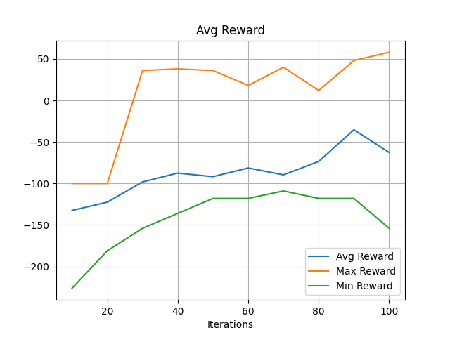
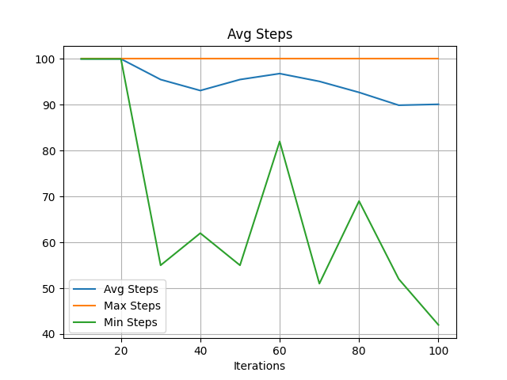
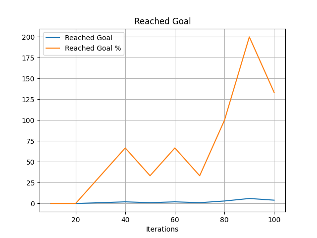
Running env with grid_size: 15x15
| Iter | Avg Reward | Max Reward | Min Reward | Avg Steps | Max Steps | Min Steps | Reached Goal | Goal % |
|------|-------------|------------|------------|-----------|-----------|-----------|---------------|--------|
| 8 - 10 | -128.80 | -109.00 | -172.00 | 100.00 | 100 | 100 | 0 | 0.0% |
| 18 - 20 | -113.50 | -100.00 | -145.00 | 100.00 | 100 | 100 | 0 | 0.0% |
| 28 - 30 | -115.30 | -100.00 | -154.00 | 100.00 | 100 | 100 | 0 | 0.0% |
| 38 - 40 | -108.10 | -100.00 | -118.00 | 100.00 | 100 | 100 | 0 | 0.0% |
| 48 - 50 | -112.60 | -100.00 | -136.00 | 100.00 | 100 | 100 | 0 | 0.0% |
| 58 - 60 | -106.30 | -100.00 | -118.00 | 100.00 | 100 | 100 | 0 | 0.0% |
| 68 - 70 | -111.70 | -100.00 | -118.00 | 100.00 | 100 | 100 | 0 | 0.0% |
| 78 - 80 | -90.20 | 34.00 | -109.00 | 95.70 | 100 | 57 | 1 | 33.3% |
| 88 - 90 | -109.00 | -100.00 | -127.00 | 100.00 | 100 | 100 | 0 | 0.0% |
| 98 - 100 | -92.50 | 2.00 | -118.00 | 98.00 | 100 | 80 | 1 | 33.3% |

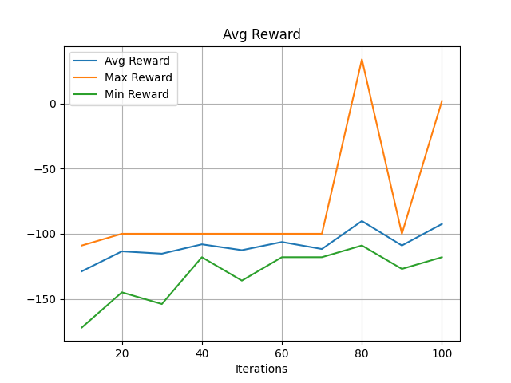
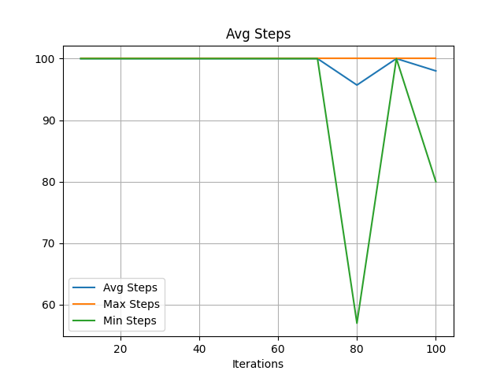
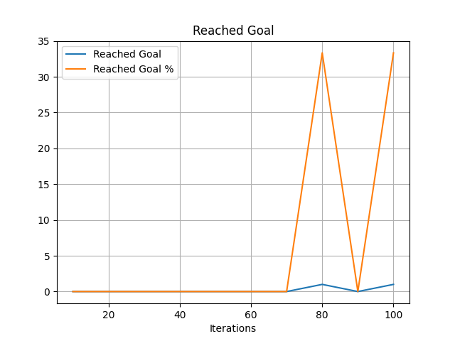
Running env with grid_size: 20x20
| Iter | Avg Reward | Max Reward | Min Reward | Avg Steps | Max Steps | Min Steps | Reached Goal | Goal % |
|------|-------------|------------|------------|-----------|-----------|-----------|---------------|--------|
| 8 - 10 | -126.10 | -100.00 | -199.00 | 100.00 | 100 | 100 | 0 | 0.0% |
| 18 - 20 | -113.50 | -100.00 | -145.00 | 100.00 | 100 | 100 | 0 | 0.0% |
| 28 - 30 | -114.40 | -100.00 | -145.00 | 100.00 | 100 | 100 | 0 | 0.0% |
| 38 - 40 | -107.20 | -100.00 | -136.00 | 100.00 | 100 | 100 | 0 | 0.0% |
| 48 - 50 | -109.00 | -100.00 | -118.00 | 100.00 | 100 | 100 | 0 | 0.0% |
| 58 - 60 | -107.20 | -100.00 | -127.00 | 100.00 | 100 | 100 | 0 | 0.0% |
| 68 - 70 | -105.40 | -100.00 | -127.00 | 100.00 | 100 | 100 | 0 | 0.0% |
| 78 - 80 | -112.60 | -100.00 | -136.00 | 100.00 | 100 | 100 | 0 | 0.0% |
| 88 - 90 | -109.00 | -100.00 | -118.00 | 100.00 | 100 | 100 | 0 | 0.0% |
| 98 - 100 | -106.30 | -100.00 | -127.00 | 100.00 | 100 | 100 | 0 | 0.0% |

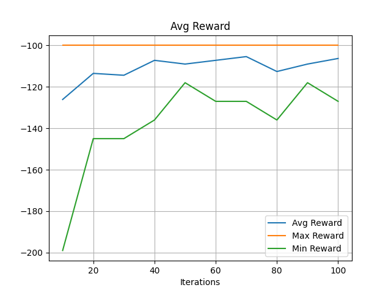
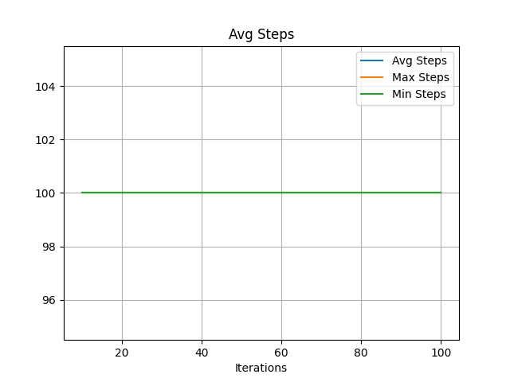
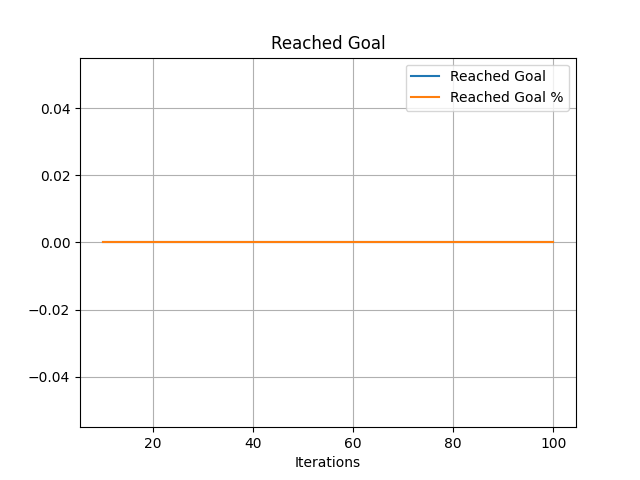
Running env with grid_size: 25x25
| Iter | Avg Reward | Max Reward | Min Reward | Avg Steps | Max Steps | Min Steps | Reached Goal | Goal % |
|------|-------------|------------|------------|-----------|-----------|-----------|---------------|--------|
| 8 - 10 | -126.10 | -100.00 | -199.00 | 100.00 | 100 | 100 | 0 | 0.0% |
| 18 - 20 | -113.50 | -100.00 | -163.00 | 100.00 | 100 | 100 | 0 | 0.0% |
| 28 - 30 | -111.70 | -100.00 | -127.00 | 100.00 | 100 | 100 | 0 | 0.0% |
| 38 - 40 | -107.20 | -100.00 | -136.00 | 100.00 | 100 | 100 | 0 | 0.0% |
| 48 - 50 | -105.40 | -100.00 | -127.00 | 100.00 | 100 | 100 | 0 | 0.0% |
| 58 - 60 | -105.40 | -100.00 | -127.00 | 100.00 | 100 | 100 | 0 | 0.0% |
| 68 - 70 | -107.20 | -100.00 | -118.00 | 100.00 | 100 | 100 | 0 | 0.0% |
| 78 - 80 | -106.30 | -100.00 | -118.00 | 100.00 | 100 | 100 | 0 | 0.0% |
| 88 - 90 | -108.10 | -100.00 | -127.00 | 100.00 | 100 | 100 | 0 | 0.0% |
| 98 - 100 | -103.60 | -100.00 | -127.00 | 100.00 | 100 | 100 | 0 | 0.0% |

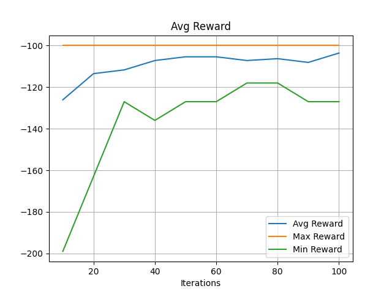

| Total Iterations | Steps | Avg Reward | Avg Steps | Reached Goal | Goal % |
|------------------|-------|------------|-----------|--------------|--------|
| 100 | 55 | 82.53 | 12.87 | 99 | 99.0% |
| 100 | 77 | 61.72 | 28.08 | 97 | 97.0% |
| 100 | 1010 | -13.24 | 71.16 | 68 | 68.0% |
| 100 | 1212 | -87.47 | 94.87 | 20 | 20.0% |
| 100 | 1515 | -108.80 | 99.37 | 2 | 2.0% |
| 100 | 2020 | -111.07 | 100.00 | 0 | 0.0% |
| 100 | 2525 | -109.45 | 100.00 | 0 | 0.0% |

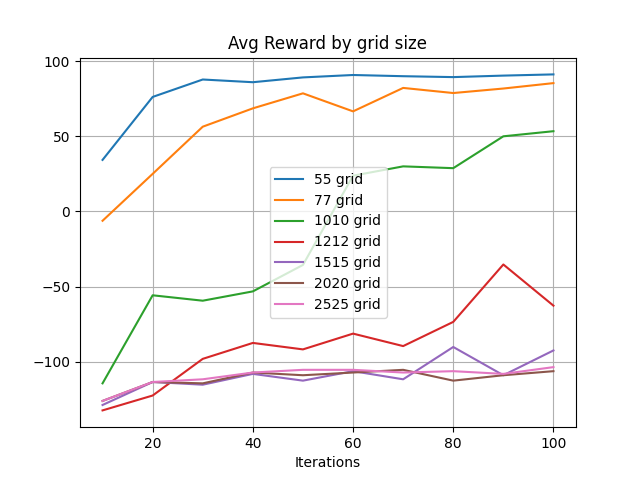
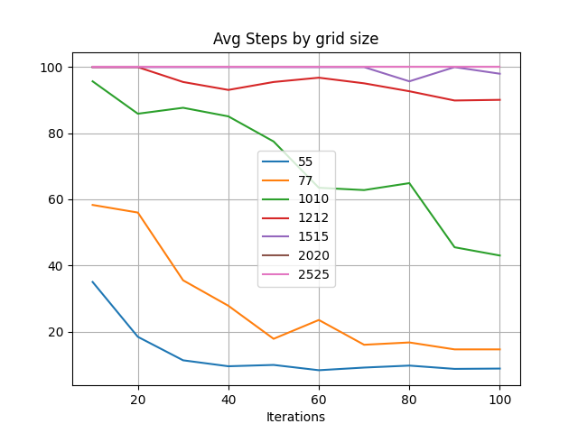

