Running env with max_steps: 10
| Iter | Avg Reward | Max Reward | Min Reward | Avg Steps | Max Steps | Min Steps | Reached Goal | Goal % |
|------|-------------|------------|------------|-----------|-----------|-----------|---------------|--------|
| 8 - 10 | -20.80 | -10.00 | -37.00 | 10.00 | 10 | 10 | 0 | 0.0% |
| 18 - 20 | -12.70 | -10.00 | -19.00 | 10.00 | 10 | 10 | 0 | 0.0% |
| 28 - 30 | -15.40 | -10.00 | -28.00 | 10.00 | 10 | 10 | 0 | 0.0% |
| 38 - 40 | -12.70 | -10.00 | -19.00 | 10.00 | 10 | 10 | 0 | 0.0% |
| 48 - 50 | 7.30 | 90.00 | -19.00 | 10.00 | 10 | 10 | 2 | 66.7% |
| 58 - 60 | -12.70 | -10.00 | -19.00 | 10.00 | 10 | 10 | 0 | 0.0% |
| 68 - 70 | 8.30 | 90.00 | -19.00 | 9.90 | 10 | 9 | 2 | 66.7% |
| 78 - 80 | 8.20 | 90.00 | -19.00 | 10.00 | 10 | 10 | 2 | 66.7% |
| 88 - 90 | 29.90 | 92.00 | -19.00 | 9.20 | 10 | 8 | 4 | 133.3% |
| 98 - 100 | 38.80 | 92.00 | -19.00 | 9.40 | 10 | 8 | 5 | 166.7% |

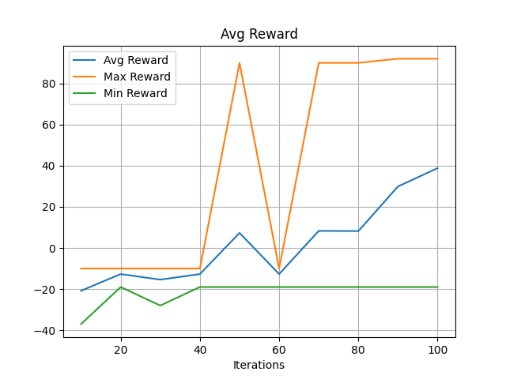
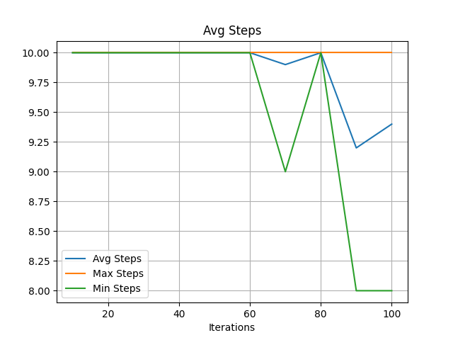
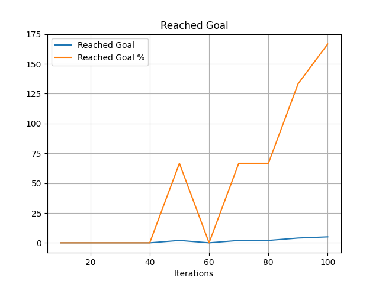
Running env with max_steps: 20
| Iter | Avg Reward | Max Reward | Min Reward | Avg Steps | Max Steps | Min Steps | Reached Goal | Goal % |
|------|-------------|------------|------------|-----------|-----------|-----------|---------------|--------|
| 8 - 10 | -1.60 | 86.00 | -47.00 | 19.00 | 20 | 14 | 3 | 100.0% |
| 18 - 20 | 35.70 | 92.00 | -47.00 | 16.20 | 20 | 8 | 6 | 200.0% |
| 28 - 30 | 52.40 | 92.00 | -29.00 | 14.00 | 20 | 8 | 7 | 233.3% |
| 38 - 40 | 87.40 | 92.00 | 80.00 | 10.80 | 14 | 8 | 10 | 333.3% |
| 48 - 50 | 88.20 | 92.00 | 80.00 | 9.10 | 11 | 8 | 10 | 333.3% |
| 58 - 60 | 92.00 | 92.00 | 92.00 | 8.00 | 8 | 8 | 10 | 333.3% |
| 68 - 70 | 89.00 | 92.00 | 76.00 | 9.20 | 15 | 8 | 10 | 333.3% |
| 78 - 80 | 90.60 | 92.00 | 82.00 | 8.50 | 10 | 8 | 10 | 333.3% |
| 88 - 90 | 91.00 | 92.00 | 90.00 | 9.00 | 10 | 8 | 10 | 333.3% |
| 98 - 100 | 91.80 | 92.00 | 90.00 | 8.20 | 10 | 8 | 10 | 333.3% |

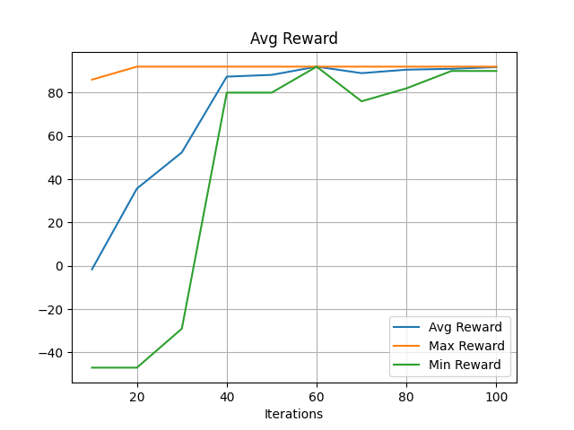
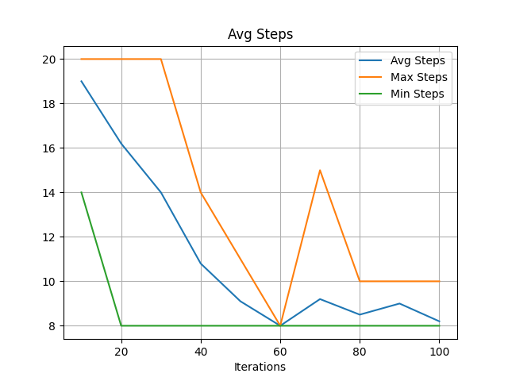
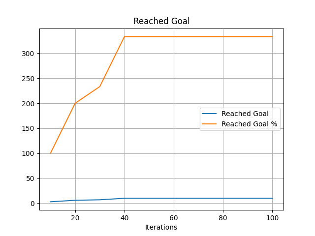
Running env with max_steps: 30
| Iter | Avg Reward | Max Reward | Min Reward | Avg Steps | Max Steps | Min Steps | Reached Goal | Goal % |
|------|-------------|------------|------------|-----------|-----------|-----------|---------------|--------|
| 8 - 10 | 8.80 | 80.00 | -66.00 | 25.00 | 30 | 16 | 5 | 166.7% |
| 18 - 20 | 53.70 | 88.00 | -57.00 | 20.00 | 30 | 12 | 8 | 266.7% |
| 28 - 30 | 85.60 | 92.00 | 74.00 | 12.60 | 22 | 8 | 10 | 333.3% |
| 38 - 40 | 89.80 | 92.00 | 80.00 | 9.30 | 12 | 8 | 10 | 333.3% |
| 48 - 50 | 88.20 | 92.00 | 72.00 | 9.10 | 11 | 8 | 10 | 333.3% |
| 58 - 60 | 89.60 | 92.00 | 82.00 | 8.60 | 10 | 8 | 10 | 333.3% |
| 68 - 70 | 88.80 | 92.00 | 80.00 | 9.40 | 11 | 8 | 10 | 333.3% |
| 78 - 80 | 90.80 | 92.00 | 82.00 | 9.20 | 18 | 8 | 10 | 333.3% |
| 88 - 90 | 91.60 | 92.00 | 90.00 | 8.40 | 10 | 8 | 10 | 333.3% |
| 98 - 100 | 88.20 | 92.00 | 72.00 | 9.10 | 12 | 8 | 10 | 333.3% |

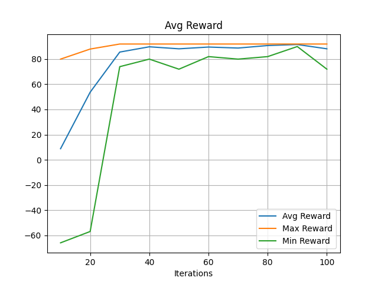
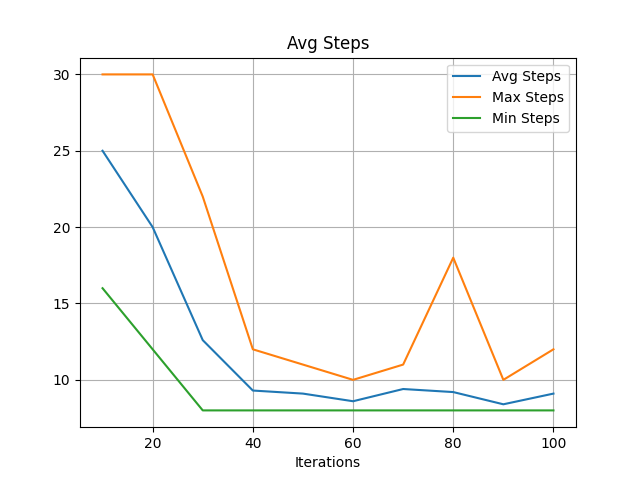
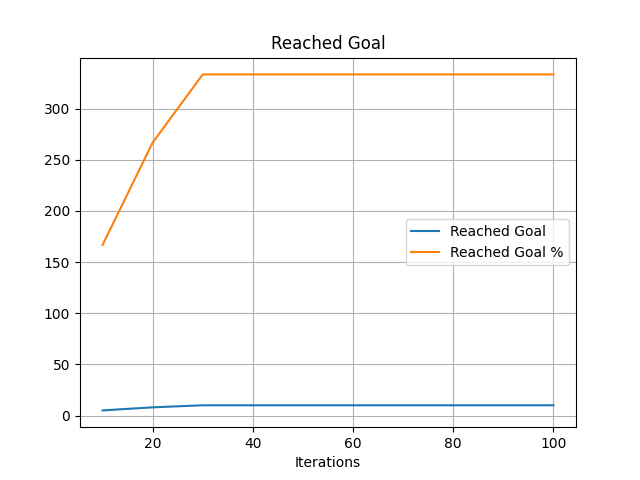
Running env with max_steps: 40
| Iter | Avg Reward | Max Reward | Min Reward | Avg Steps | Max Steps | Min Steps | Reached Goal | Goal % |
|------|-------------|------------|------------|-----------|-----------|-----------|---------------|--------|
| 8 - 10 | 20.90 | 86.00 | -85.00 | 31.10 | 40 | 14 | 7 | 233.3% |
| 18 - 20 | 80.40 | 92.00 | 62.00 | 16.00 | 29 | 8 | 10 | 333.3% |
| 28 - 30 | 89.60 | 92.00 | 82.00 | 10.40 | 18 | 8 | 10 | 333.3% |
| 38 - 40 | 88.80 | 92.00 | 80.00 | 10.30 | 12 | 8 | 10 | 333.3% |
| 48 - 50 | 89.40 | 92.00 | 80.00 | 8.80 | 11 | 8 | 10 | 333.3% |
| 58 - 60 | 90.20 | 92.00 | 82.00 | 8.90 | 12 | 8 | 10 | 333.3% |
| 68 - 70 | 91.20 | 92.00 | 86.00 | 8.80 | 14 | 8 | 10 | 333.3% |
| 78 - 80 | 87.80 | 92.00 | 82.00 | 9.50 | 14 | 8 | 10 | 333.3% |
| 88 - 90 | 91.20 | 92.00 | 90.00 | 8.80 | 10 | 8 | 10 | 333.3% |
| 98 - 100 | 90.40 | 92.00 | 86.00 | 9.60 | 14 | 8 | 10 | 333.3% |

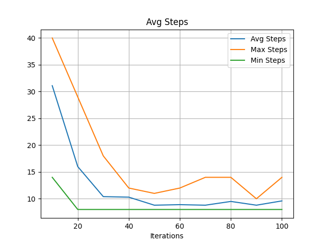

Running env with max_steps: 50
| Iter | Avg Reward | Max Reward | Min Reward | Avg Steps | Max Steps | Min Steps | Reached Goal | Goal % |
|------|-------------|------------|------------|-----------|-----------|-----------|---------------|--------|
| 8 - 10 | 17.70 | 84.00 | -113.00 | 29.80 | 50 | 16 | 7 | 233.3% |
| 18 - 20 | 80.40 | 92.00 | 56.00 | 17.80 | 44 | 8 | 10 | 333.3% |
| 28 - 30 | 89.20 | 92.00 | 82.00 | 9.90 | 14 | 8 | 10 | 333.3% |
| 38 - 40 | 86.40 | 92.00 | 72.00 | 9.10 | 10 | 8 | 10 | 333.3% |
| 48 - 50 | 90.40 | 92.00 | 82.00 | 8.70 | 10 | 8 | 10 | 333.3% |
| 58 - 60 | 91.20 | 92.00 | 86.00 | 8.80 | 14 | 8 | 10 | 333.3% |
| 68 - 70 | 90.00 | 92.00 | 80.00 | 9.10 | 12 | 8 | 10 | 333.3% |
| 78 - 80 | 89.60 | 92.00 | 80.00 | 8.60 | 11 | 8 | 10 | 333.3% |
| 88 - 90 | 90.00 | 92.00 | 80.00 | 9.10 | 12 | 8 | 10 | 333.3% |
| 98 - 100 | 89.20 | 92.00 | 80.00 | 9.00 | 11 | 8 | 10 | 333.3% |

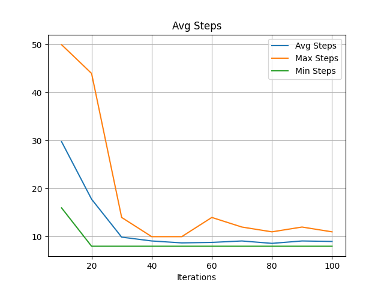
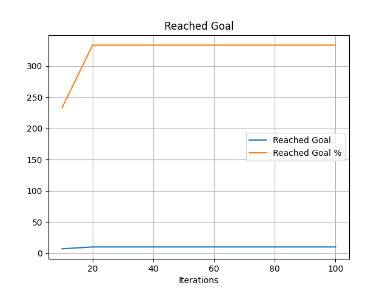
Running env with max_steps: 60
| Iter | Avg Reward | Max Reward | Min Reward | Avg Steps | Max Steps | Min Steps | Reached Goal | Goal % |
|------|-------------|------------|------------|-----------|-----------|-----------|---------------|--------|
| 8 - 10 | 14.50 | 84.00 | -114.00 | 35.70 | 60 | 16 | 7 | 233.3% |
| 18 - 20 | 78.60 | 92.00 | 58.00 | 17.80 | 42 | 8 | 10 | 333.3% |
| 28 - 30 | 87.20 | 92.00 | 76.00 | 11.90 | 18 | 8 | 10 | 333.3% |
| 38 - 40 | 85.20 | 92.00 | 74.00 | 11.20 | 17 | 8 | 10 | 333.3% |
| 48 - 50 | 90.40 | 92.00 | 80.00 | 8.70 | 11 | 8 | 10 | 333.3% |
| 58 - 60 | 88.60 | 92.00 | 72.00 | 8.70 | 10 | 8 | 10 | 333.3% |
| 68 - 70 | 89.80 | 92.00 | 80.00 | 8.40 | 11 | 8 | 10 | 333.3% |
| 78 - 80 | 89.20 | 92.00 | 72.00 | 9.00 | 12 | 8 | 10 | 333.3% |
| 88 - 90 | 90.60 | 92.00 | 90.00 | 9.40 | 10 | 8 | 10 | 333.3% |
| 98 - 100 | 89.40 | 92.00 | 80.00 | 8.80 | 11 | 8 | 10 | 333.3% |

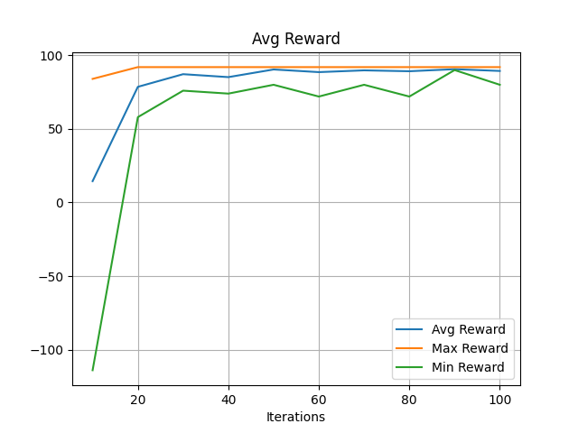
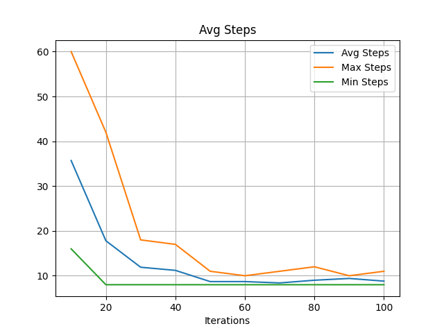

Running env with max_steps: 70
| Iter | Avg Reward | Max Reward | Min Reward | Avg Steps | Max Steps | Min Steps | Reached Goal | Goal % |
|------|-------------|------------|------------|-----------|-----------|-----------|---------------|--------|
| 8 - 10 | 40.40 | 92.00 | -160.00 | 33.40 | 70 | 8 | 9 | 300.0% |
| 18 - 20 | 73.60 | 90.00 | 56.00 | 18.30 | 36 | 9 | 10 | 333.3% |
| 28 - 30 | 88.40 | 92.00 | 80.00 | 9.80 | 12 | 8 | 10 | 333.3% |
| 38 - 40 | 87.60 | 92.00 | 78.00 | 9.70 | 13 | 8 | 10 | 333.3% |
| 48 - 50 | 89.00 | 92.00 | 82.00 | 8.30 | 9 | 8 | 10 | 333.3% |
| 58 - 60 | 89.00 | 92.00 | 82.00 | 8.30 | 9 | 8 | 10 | 333.3% |
| 68 - 70 | 89.40 | 92.00 | 82.00 | 8.80 | 10 | 8 | 10 | 333.3% |
| 78 - 80 | 90.60 | 92.00 | 80.00 | 8.50 | 11 | 8 | 10 | 333.3% |
| 88 - 90 | 89.80 | 92.00 | 82.00 | 8.40 | 10 | 8 | 10 | 333.3% |
| 98 - 100 | 89.80 | 92.00 | 82.00 | 9.30 | 16 | 8 | 10 | 333.3% |

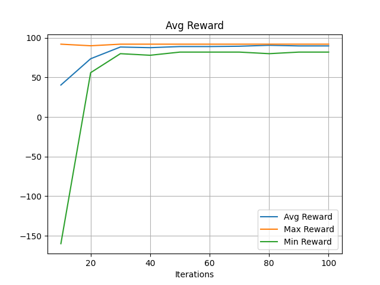
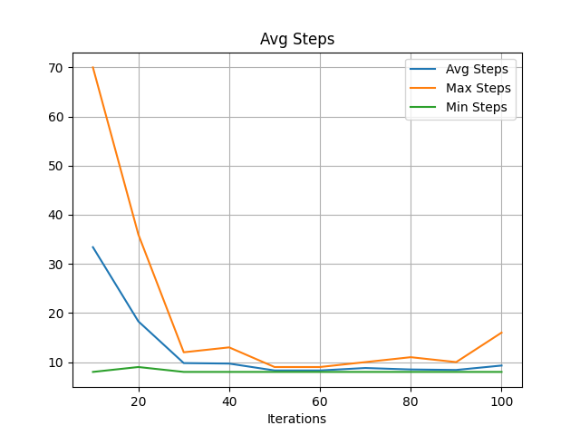
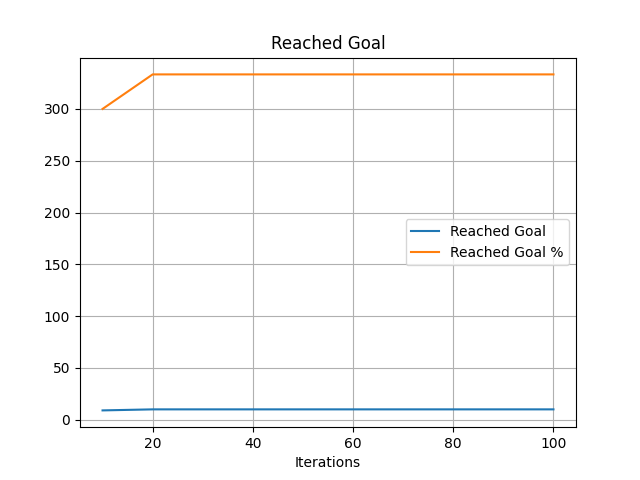
Running env with max_steps: 80
| Iter | Avg Reward | Max Reward | Min Reward | Avg Steps | Max Steps | Min Steps | Reached Goal | Goal % |
|------|-------------|------------|------------|-----------|-----------|-----------|---------------|--------|
| 8 - 10 | 48.80 | 92.00 | -2.00 | 31.40 | 50 | 8 | 10 | 333.3% |
| 18 - 20 | 80.00 | 92.00 | 32.00 | 16.40 | 50 | 8 | 10 | 333.3% |
| 28 - 30 | 84.80 | 92.00 | 74.00 | 11.60 | 17 | 8 | 10 | 333.3% |
| 38 - 40 | 91.40 | 92.00 | 90.00 | 8.60 | 10 | 8 | 10 | 333.3% |
| 48 - 50 | 92.00 | 92.00 | 92.00 | 8.00 | 8 | 8 | 10 | 333.3% |
| 58 - 60 | 88.80 | 92.00 | 76.00 | 9.40 | 15 | 8 | 10 | 333.3% |
| 68 - 70 | 87.60 | 92.00 | 72.00 | 8.80 | 11 | 8 | 10 | 333.3% |
| 78 - 80 | 89.60 | 92.00 | 80.00 | 8.60 | 11 | 8 | 10 | 333.3% |
| 88 - 90 | 88.40 | 92.00 | 80.00 | 8.90 | 11 | 8 | 10 | 333.3% |
| 98 - 100 | 90.60 | 92.00 | 80.00 | 8.50 | 11 | 8 | 10 | 333.3% |

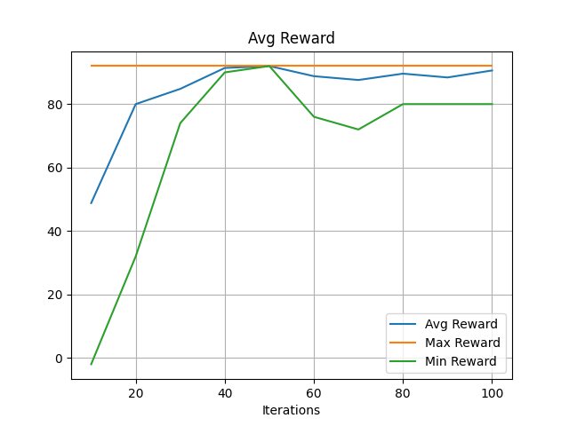
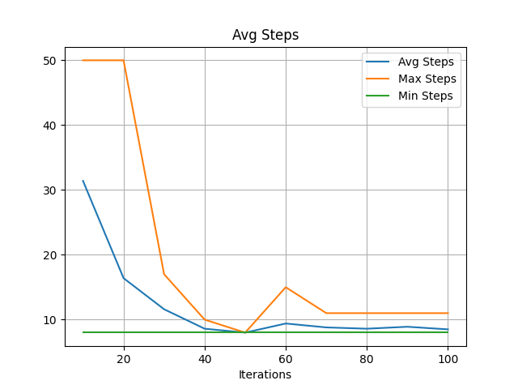
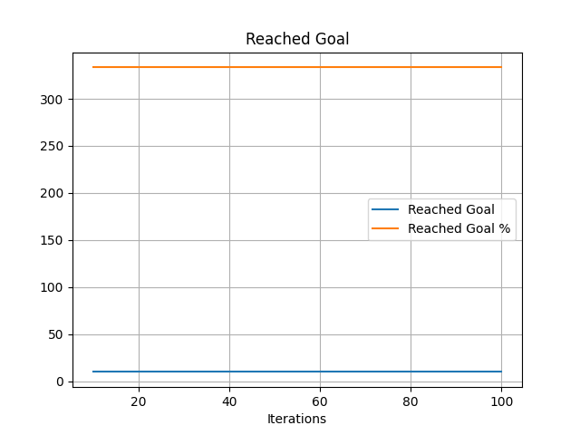
Running env with max_steps: 90
| Iter | Avg Reward | Max Reward | Min Reward | Avg Steps | Max Steps | Min Steps | Reached Goal | Goal % |
|------|-------------|------------|------------|-----------|-----------|-----------|---------------|--------|
| 8 - 10 | 47.40 | 90.00 | -36.00 | 35.50 | 64 | 10 | 10 | 333.3% |
| 18 - 20 | 78.40 | 88.00 | 46.00 | 16.20 | 27 | 9 | 10 | 333.3% |
| 28 - 30 | 85.60 | 90.00 | 72.00 | 11.70 | 16 | 10 | 10 | 333.3% |
| 38 - 40 | 84.20 | 92.00 | 70.00 | 10.40 | 16 | 8 | 10 | 333.3% |
| 48 - 50 | 90.40 | 92.00 | 82.00 | 8.70 | 12 | 8 | 10 | 333.3% |
| 58 - 60 | 88.80 | 92.00 | 70.00 | 8.50 | 12 | 8 | 10 | 333.3% |
| 68 - 70 | 89.40 | 92.00 | 82.00 | 8.80 | 10 | 8 | 10 | 333.3% |
| 78 - 80 | 91.60 | 92.00 | 90.00 | 8.40 | 10 | 8 | 10 | 333.3% |
| 88 - 90 | 91.80 | 92.00 | 90.00 | 8.20 | 10 | 8 | 10 | 333.3% |
| 98 - 100 | 90.40 | 92.00 | 82.00 | 8.70 | 10 | 8 | 10 | 333.3% |

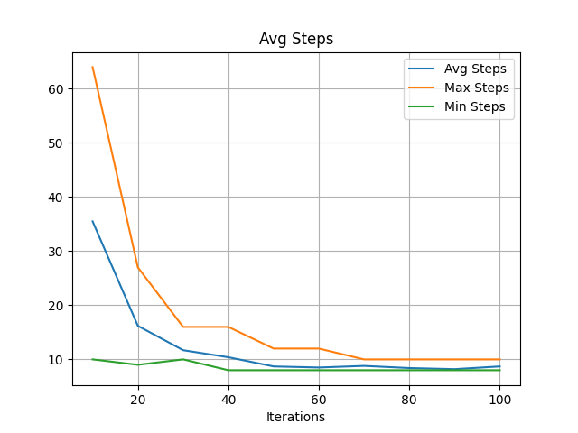

Running env with max_steps: 100
| Iter | Avg Reward | Max Reward | Min Reward | Avg Steps | Max Steps | Min Steps | Reached Goal | Goal % |
|------|-------------|------------|------------|-----------|-----------|-----------|---------------|--------|
| 8 - 10 | 49.00 | 82.00 | -70.00 | 28.50 | 62 | 18 | 10 | 333.3% |
| 18 - 20 | 82.60 | 92.00 | 60.00 | 15.60 | 40 | 8 | 10 | 333.3% |
| 28 - 30 | 85.80 | 92.00 | 66.00 | 10.60 | 16 | 8 | 10 | 333.3% |
| 38 - 40 | 89.60 | 92.00 | 82.00 | 8.60 | 12 | 8 | 10 | 333.3% |
| 48 - 50 | 91.20 | 92.00 | 88.00 | 8.80 | 12 | 8 | 10 | 333.3% |
| 58 - 60 | 89.80 | 92.00 | 82.00 | 8.40 | 10 | 8 | 10 | 333.3% |
| 68 - 70 | 91.60 | 92.00 | 90.00 | 8.40 | 10 | 8 | 10 | 333.3% |
| 78 - 80 | 90.60 | 92.00 | 88.00 | 9.40 | 12 | 8 | 10 | 333.3% |
| 88 - 90 | 91.60 | 92.00 | 90.00 | 8.40 | 10 | 8 | 10 | 333.3% |
| 98 - 100 | 91.00 | 92.00 | 88.00 | 9.00 | 12 | 8 | 10 | 333.3% |

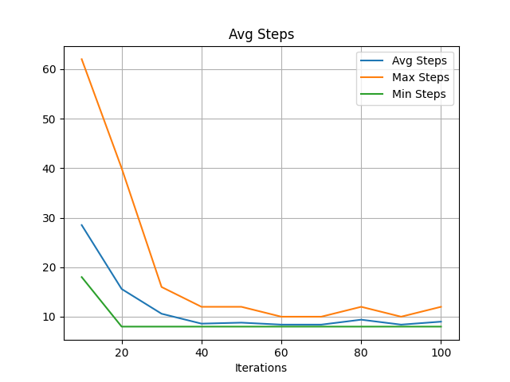

Running env with max_steps: 110
| Iter | Avg Reward | Max Reward | Min Reward | Avg Steps | Max Steps | Min Steps | Reached Goal | Goal % |
|------|-------------|------------|------------|-----------|-----------|-----------|---------------|--------|
| 8 - 10 | 51.20 | 92.00 | -90.00 | 30.80 | 73 | 8 | 10 | 333.3% |
| 18 - 20 | 75.20 | 92.00 | 20.00 | 16.70 | 44 | 8 | 10 | 333.3% |
| 28 - 30 | 87.40 | 92.00 | 78.00 | 10.80 | 14 | 8 | 10 | 333.3% |
| 38 - 40 | 88.00 | 92.00 | 70.00 | 9.30 | 12 | 8 | 10 | 333.3% |
| 48 - 50 | 88.80 | 92.00 | 78.00 | 9.40 | 13 | 8 | 10 | 333.3% |
| 58 - 60 | 90.60 | 92.00 | 82.00 | 8.50 | 10 | 8 | 10 | 333.3% |
| 68 - 70 | 89.00 | 92.00 | 82.00 | 9.20 | 12 | 8 | 10 | 333.3% |
| 78 - 80 | 90.80 | 92.00 | 82.00 | 8.30 | 10 | 8 | 10 | 333.3% |
| 88 - 90 | 91.60 | 92.00 | 90.00 | 8.40 | 10 | 8 | 10 | 333.3% |
| 98 - 100 | 89.60 | 92.00 | 80.00 | 9.50 | 12 | 8 | 10 | 333.3% |

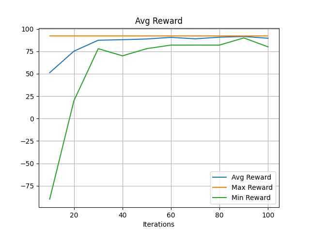
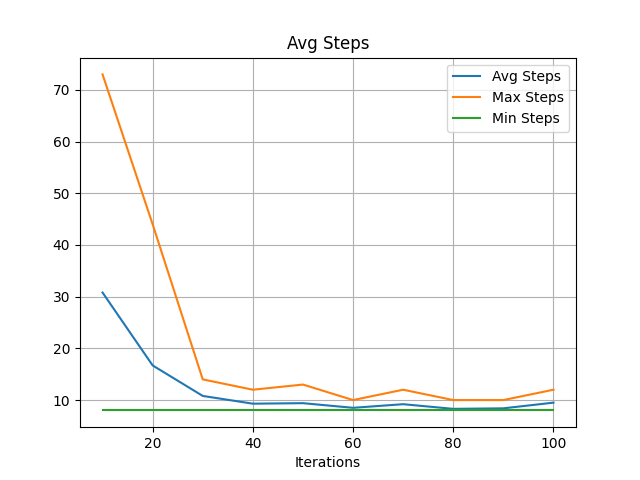

Running env with max_steps: 120
| Iter | Avg Reward | Max Reward | Min Reward | Avg Steps | Max Steps | Min Steps | Reached Goal | Goal % |
|------|-------------|------------|------------|-----------|-----------|-----------|---------------|--------|
| 8 - 10 | 47.20 | 92.00 | -28.00 | 34.80 | 74 | 8 | 10 | 333.3% |
| 18 - 20 | 76.40 | 92.00 | 58.00 | 17.30 | 33 | 8 | 10 | 333.3% |
| 28 - 30 | 88.40 | 92.00 | 78.00 | 10.70 | 16 | 8 | 10 | 333.3% |
| 38 - 40 | 89.60 | 92.00 | 80.00 | 9.50 | 18 | 8 | 10 | 333.3% |
| 48 - 50 | 89.00 | 92.00 | 80.00 | 9.20 | 11 | 8 | 10 | 333.3% |
| 58 - 60 | 90.60 | 92.00 | 82.00 | 8.50 | 10 | 8 | 10 | 333.3% |
| 68 - 70 | 91.00 | 92.00 | 82.00 | 8.10 | 9 | 8 | 10 | 333.3% |
| 78 - 80 | 91.60 | 92.00 | 90.00 | 8.40 | 10 | 8 | 10 | 333.3% |
| 88 - 90 | 89.60 | 92.00 | 82.00 | 8.60 | 10 | 8 | 10 | 333.3% |
| 98 - 100 | 90.00 | 92.00 | 82.00 | 9.10 | 12 | 8 | 10 | 333.3% |

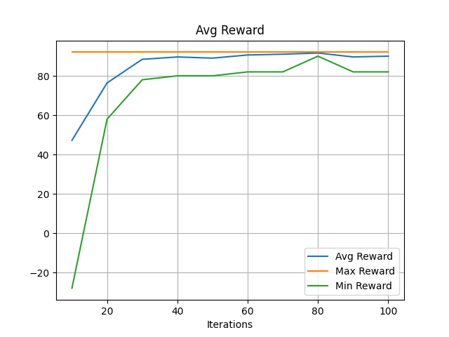
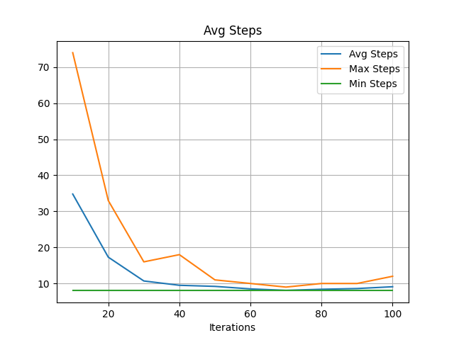

Running env with max_steps: 130
| Iter | Avg Reward | Max Reward | Min Reward | Avg Steps | Max Steps | Min Steps | Reached Goal | Goal % |
|------|-------------|------------|------------|-----------|-----------|-----------|---------------|--------|
| 8 - 10 | 46.80 | 86.00 | -114.00 | 36.10 | 106 | 14 | 10 | 333.3% |
| 18 - 20 | 79.20 | 92.00 | 54.00 | 14.50 | 28 | 8 | 10 | 333.3% |
| 28 - 30 | 85.60 | 92.00 | 68.00 | 12.60 | 23 | 8 | 10 | 333.3% |
| 38 - 40 | 88.60 | 92.00 | 80.00 | 9.60 | 16 | 8 | 10 | 333.3% |
| 48 - 50 | 88.40 | 92.00 | 72.00 | 9.80 | 14 | 8 | 10 | 333.3% |
| 58 - 60 | 88.40 | 92.00 | 72.00 | 8.90 | 12 | 8 | 10 | 333.3% |
| 68 - 70 | 90.00 | 92.00 | 82.00 | 9.10 | 12 | 8 | 10 | 333.3% |
| 78 - 80 | 89.80 | 92.00 | 82.00 | 8.40 | 10 | 8 | 10 | 333.3% |
| 88 - 90 | 90.40 | 92.00 | 82.00 | 8.70 | 12 | 8 | 10 | 333.3% |
| 98 - 100 | 91.00 | 92.00 | 88.00 | 9.00 | 12 | 8 | 10 | 333.3% |

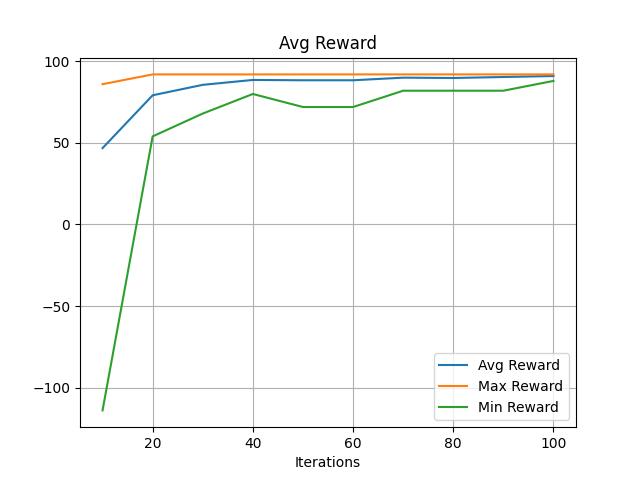
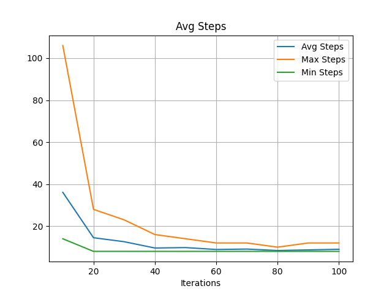

Running env with max_steps: 140
| Iter | Avg Reward | Max Reward | Min Reward | Avg Steps | Max Steps | Min Steps | Reached Goal | Goal % |
|------|-------------|------------|------------|-----------|-----------|-----------|---------------|--------|
| 8 - 10 | 50.00 | 86.00 | -136.00 | 32.00 | 101 | 14 | 10 | 333.3% |
| 18 - 20 | 81.20 | 92.00 | 46.00 | 15.20 | 36 | 8 | 10 | 333.3% |
| 28 - 30 | 86.80 | 92.00 | 72.00 | 12.30 | 19 | 8 | 10 | 333.3% |
| 38 - 40 | 88.00 | 92.00 | 80.00 | 10.20 | 16 | 8 | 10 | 333.3% |
| 48 - 50 | 88.60 | 92.00 | 78.00 | 9.60 | 13 | 8 | 10 | 333.3% |
| 58 - 60 | 89.80 | 92.00 | 76.00 | 9.30 | 15 | 8 | 10 | 333.3% |
| 68 - 70 | 86.80 | 92.00 | 68.00 | 9.60 | 14 | 8 | 10 | 333.3% |
| 78 - 80 | 88.40 | 92.00 | 80.00 | 8.90 | 11 | 8 | 10 | 333.3% |
| 88 - 90 | 91.80 | 92.00 | 90.00 | 8.20 | 10 | 8 | 10 | 333.3% |
| 98 - 100 | 88.20 | 92.00 | 80.00 | 9.10 | 11 | 8 | 10 | 333.3% |

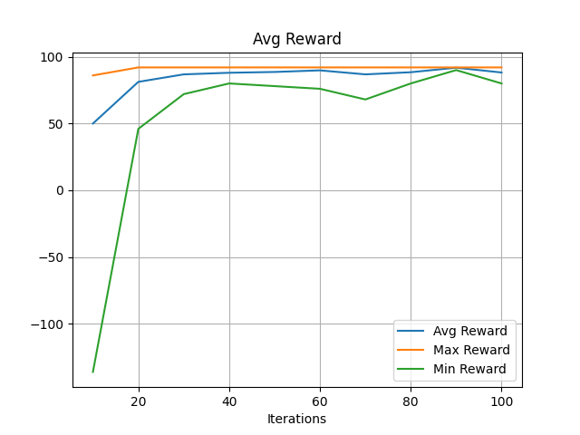

Running env with max_steps: 150
| Iter | Avg Reward | Max Reward | Min Reward | Avg Steps | Max Steps | Min Steps | Reached Goal | Goal % |
|------|-------------|------------|------------|-----------|-----------|-----------|---------------|--------|
| 8 - 10 | 52.80 | 90.00 | -44.00 | 30.10 | 71 | 10 | 10 | 333.3% |
| 18 - 20 | 79.60 | 92.00 | 58.00 | 16.80 | 30 | 8 | 10 | 333.3% |
| 28 - 30 | 82.20 | 92.00 | 70.00 | 13.30 | 21 | 8 | 10 | 333.3% |
| 38 - 40 | 88.40 | 92.00 | 78.00 | 9.80 | 14 | 8 | 10 | 333.3% |
| 48 - 50 | 89.20 | 92.00 | 70.00 | 9.00 | 12 | 8 | 10 | 333.3% |
| 58 - 60 | 91.20 | 92.00 | 88.00 | 8.80 | 12 | 8 | 10 | 333.3% |
| 68 - 70 | 92.00 | 92.00 | 92.00 | 8.00 | 8 | 8 | 10 | 333.3% |
| 78 - 80 | 91.00 | 92.00 | 88.00 | 9.00 | 12 | 8 | 10 | 333.3% |
| 88 - 90 | 90.60 | 92.00 | 86.00 | 9.40 | 14 | 8 | 10 | 333.3% |
| 98 - 100 | 88.00 | 92.00 | 58.00 | 9.30 | 15 | 8 | 10 | 333.3% |

| Total Iterations | Steps | Avg Reward | Avg Steps | Reached Goal | Goal % |
|------------------|-------|------------|-----------|--------------|--------|
| 100 | 10 | 1.82 | 9.85 | 15 | 15.0% |
| 100 | 20 | 71.65 | 11.20 | 86 | 86.0% |
| 100 | 30 | 77.51 | 12.07 | 93 | 93.0% |
| 100 | 40 | 81.99 | 12.22 | 97 | 97.0% |
| 100 | 50 | 81.41 | 11.99 | 97 | 97.0% |
| 100 | 60 | 80.35 | 12.96 | 97 | 97.0% |
| 100 | 70 | 82.76 | 12.28 | 99 | 99.0% |
| 100 | 80 | 84.20 | 12.02 | 100 | 100.0% |
| 100 | 90 | 83.80 | 12.51 | 100 | 100.0% |
| 100 | 100 | 85.28 | 11.57 | 100 | 100.0% |

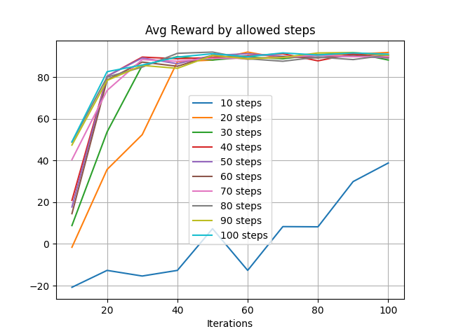
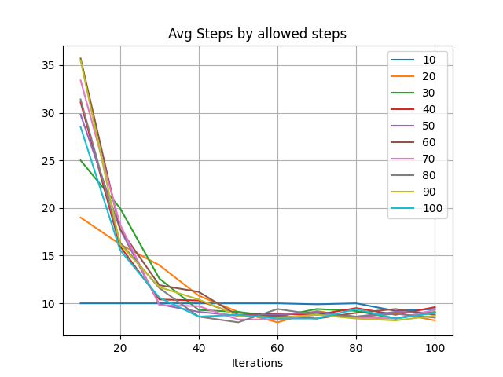
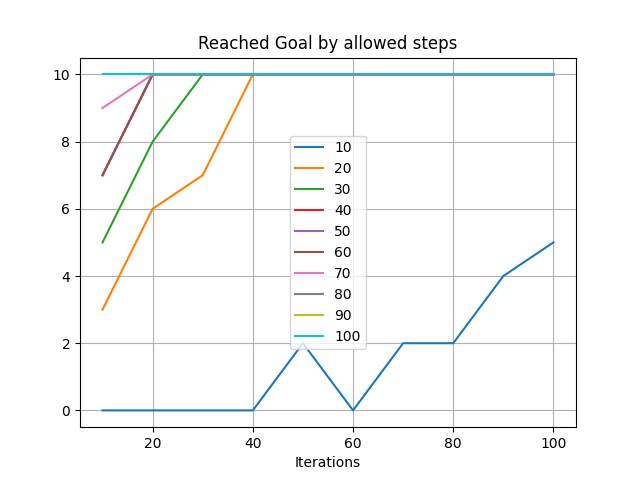
