Learning Agent: QLearningAgent with 0.1 epsilon and 0.1 alpha.
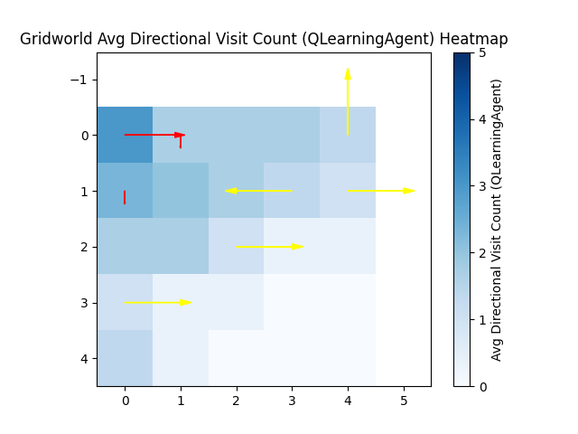
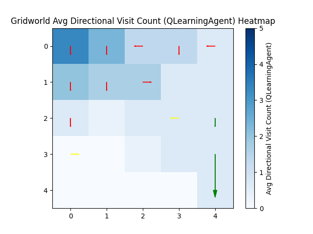
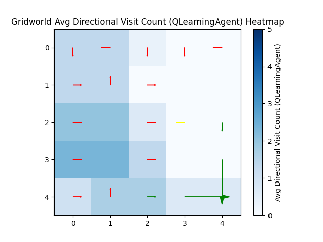
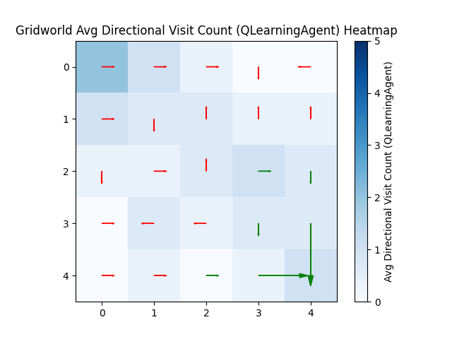
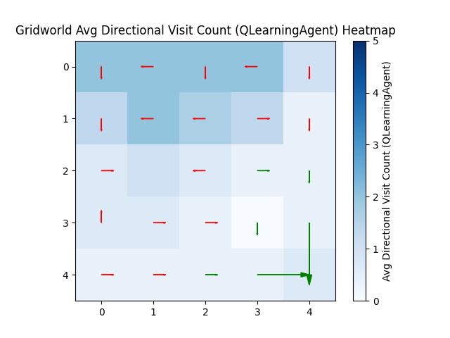
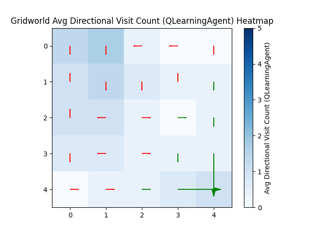
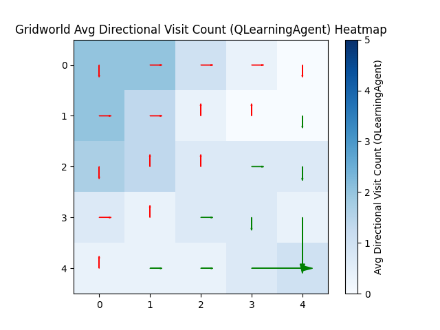
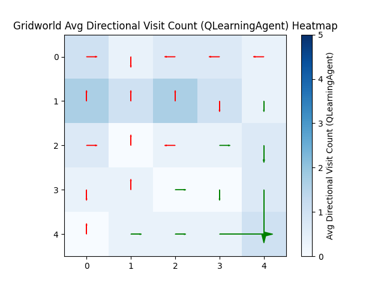
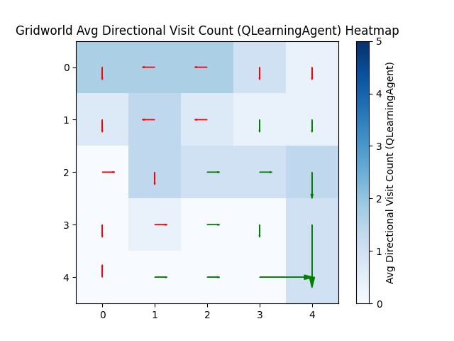
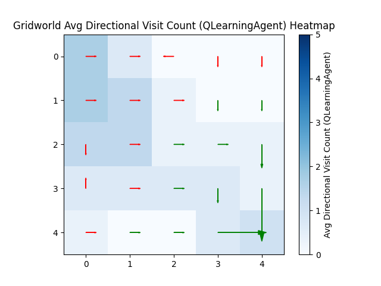
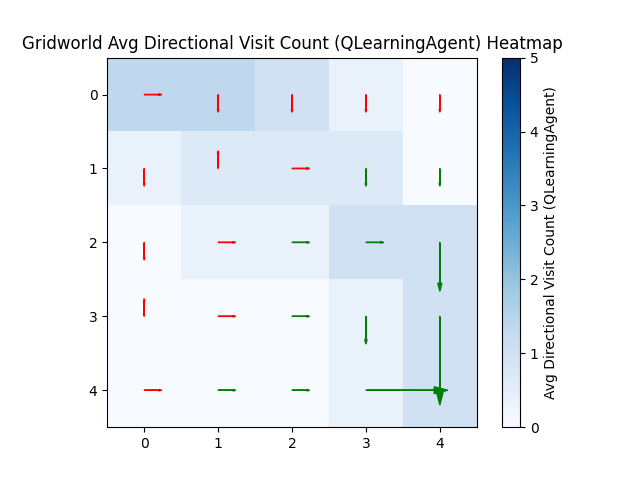
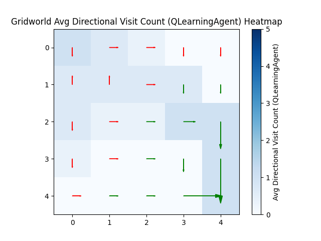
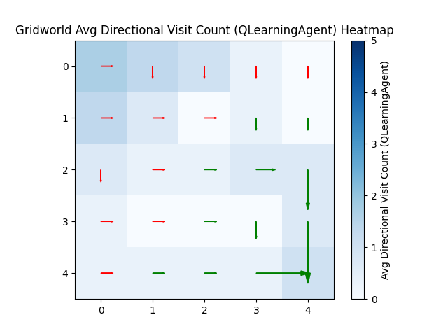
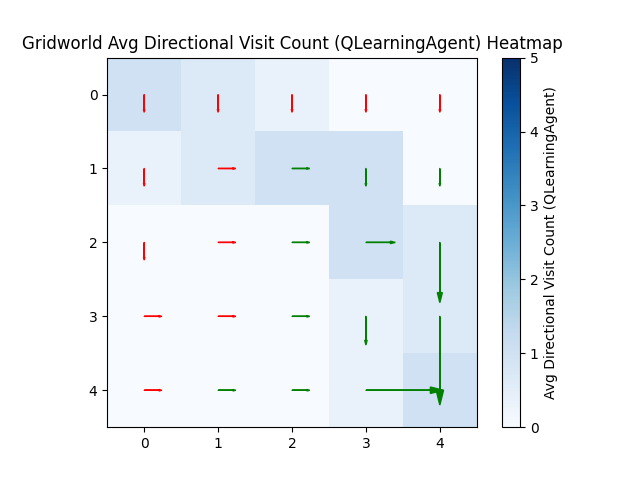
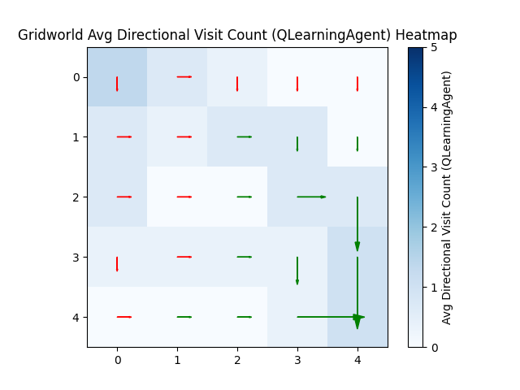
Learning Agent Summary:
| Iter | Avg Reward | Max Reward | Min Reward | Avg Steps | Max Steps | Min Steps | Reached Goal | Goal % |
|------|-------------|------------|------------|-----------|-----------|-----------|---------------|--------|
| 1 - 3 | -67.00 | -52.00 | -88.00 | 25.00 | 25 | 25 | 0 | 0.0% |
| 4 - 6 | 25.67 | 90.00 | -61.00 | 20.00 | 25 | 10 | 2 | 66.7% |
| 7 - 9 | 39.67 | 84.00 | -25.00 | 21.00 | 25 | 16 | 2 | 66.7% |
| 10 - 12 | 84.67 | 90.00 | 78.00 | 12.33 | 14 | 10 | 3 | 100.0% |
| 13 - 15 | 42.00 | 80.00 | -34.00 | 21.67 | 25 | 20 | 2 | 66.7% |
| 16 - 18 | 80.67 | 90.00 | 76.00 | 13.33 | 15 | 10 | 3 | 100.0% |
| 19 - 21 | 78.67 | 88.00 | 66.00 | 18.33 | 25 | 12 | 3 | 100.0% |
| 22 - 24 | 84.00 | 90.00 | 78.00 | 13.00 | 16 | 10 | 3 | 100.0% |
| 25 - 27 | 81.33 | 90.00 | 66.00 | 15.67 | 25 | 10 | 3 | 100.0% |
| 28 - 30 | 86.67 | 92.00 | 82.00 | 13.33 | 18 | 8 | 3 | 100.0% |
| 31 - 33 | 89.33 | 90.00 | 88.00 | 10.67 | 12 | 10 | 3 | 100.0% |
| 34 - 36 | 90.67 | 92.00 | 88.00 | 9.33 | 12 | 8 | 3 | 100.0% |
| 37 - 39 | 85.33 | 92.00 | 76.00 | 11.67 | 15 | 8 | 3 | 100.0% |
| 40 - 42 | 92.00 | 92.00 | 92.00 | 8.00 | 8 | 8 | 3 | 100.0% |
| 43 - 45 | 84.67 | 90.00 | 82.00 | 9.33 | 10 | 9 | 3 | 100.0% |

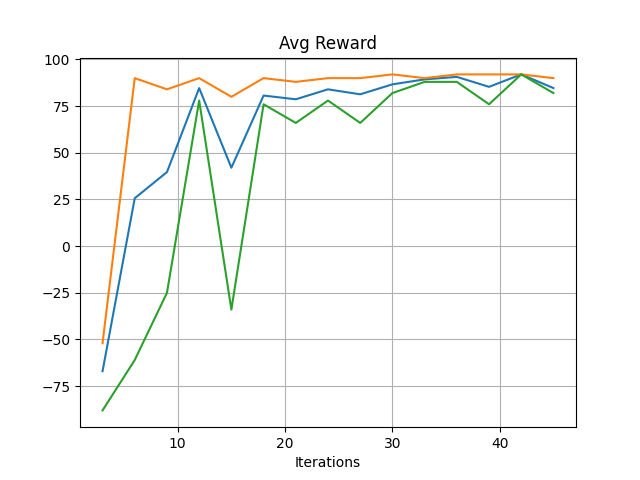
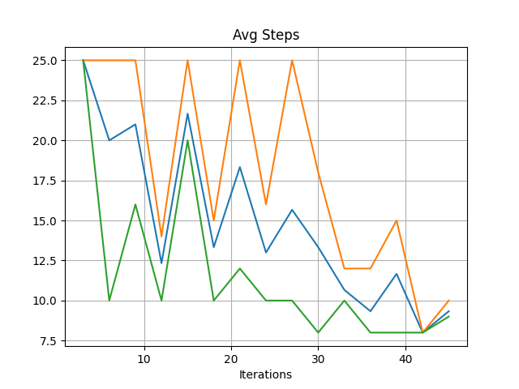
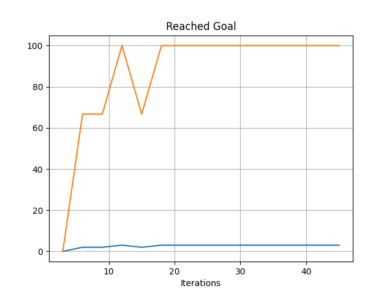
